# Architecture Documentation

This document provides a detailed overview of the architecture for implementing dynamic or elastic memory capacities in Kubernetes using Compute Express Link (CXL) Dynamic Capacity Devices (DCD). The architecture leverages Kubernetes extension mechanisms, including the Dynamic Resource Allocation (DRA) framework, custom scheduler plugins, and DaemonSets, to enable dynamic memory provisioning without modifying core Kubernetes components.

---

## Table of Contents

1. [Introduction](#introduction)
2. [High-Level Architecture](#high-level-architecture)
3. [Components](#components)
   - [1. Dynamic Resource Allocation (DRA) Driver](#1-dynamic-resource-allocation-dra-driver)
   - [2. Scheduler Plugin](#2-scheduler-plugin)
   - [3. Node Capacity Updater DaemonSet](#3-node-capacity-updater-daemonset)
   - [4. Dynamic Memory Service](#4-dynamic-memory-service)
   - [5. Custom Resource Definitions (CRDs)](#5-custom-resource-definitions-crds)
   - [6. Kubectl Plugin](#6-kubectl-plugin)
   - [7. Metrics Exporter](#7-metrics-exporter)
4. [Workflow](#workflow)
   - [1. Pod Creation and Scheduling](#1-pod-creation-and-scheduling)
   - [2. Dynamic Memory Allocation](#2-dynamic-memory-allocation)
   - [3. Node Capacity Update](#3-node-capacity-update)
   - [4. Pod Execution](#4-pod-execution)
   - [5. Pod Termination and Resource Cleanup](#5-pod-termination-and-resource-cleanup)
5. [Component Interactions](#component-interactions)
6. [Security Considerations](#security-considerations)
7. [Scalability and Performance](#scalability-and-performance)
8. [Monitoring and Metrics](#monitoring-and-metrics)
9. [Conclusion](#conclusion)

---

## Introduction

The advent of Compute Express Link (CXL) Dynamic Capacity Devices (DCD) introduces the ability to dynamically add and remove memory at runtime without rebooting the host or restarting applications. Integrating this capability into Kubernetes requires a thoughtful architecture that leverages Kubernetes' extensibility while maintaining system stability and performance.

This document outlines the architecture designed to support dynamic memory capacities in Kubernetes clusters. The solution aims to:

- Enable pods to request dynamic memory resources.
- Allow Kubernetes to schedule pods based on both static and dynamically allocatable memory.
- Provision memory on-demand using a dynamic memory service.
- Update node capacities to reflect the newly provisioned memory.
- Integrate monitoring and management tools for visibility and control.

---

## High-Level Architecture

The architecture comprises several components that interact to facilitate dynamic memory allocation and management in a Kubernetes cluster.

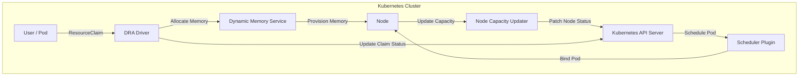

---

## Components

### 1. Dynamic Resource Allocation (DRA) Driver

**Purpose**: Handles dynamic memory allocation requests from pods and interfaces with the dynamic memory service to provision memory.

**Responsibilities**:

- Implements the DRA gRPC protocol.
- Processes `ResourceClaims` for dynamic memory.
- Communicates with the dynamic memory service via gRPC.
- Updates the status of `ResourceClaims` with allocation details.

**Diagram**:

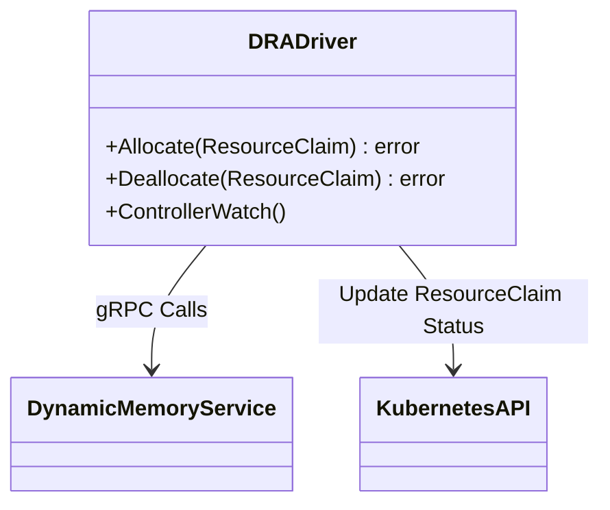

### 2. Scheduler Plugin

**Purpose**: Enhances the Kubernetes scheduler to consider dynamic memory when scheduling pods.

**Responsibilities**:

- Implements custom scheduling logic using the Scheduler Framework.
- Filters nodes based on their ability to allocate dynamic memory.
- Scores nodes based on dynamic memory provisioning criteria.

**Diagram**:

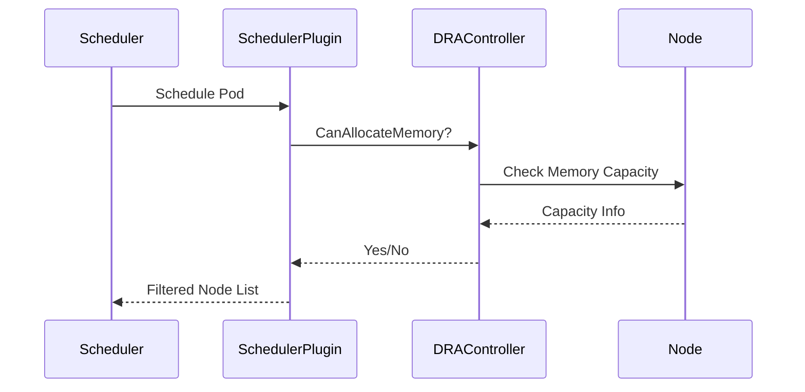

### 3. Node Capacity Updater DaemonSet

**Purpose**: Runs on each node to monitor actual memory capacity and update the node's status in the Kubernetes API.

**Responsibilities**:

- Communicates with the dynamic memory service to get current memory capacity.
- Updates `status.capacity` and `status.allocatable` fields of the node.
- Ensures the scheduler has up-to-date information.

**Diagram**:

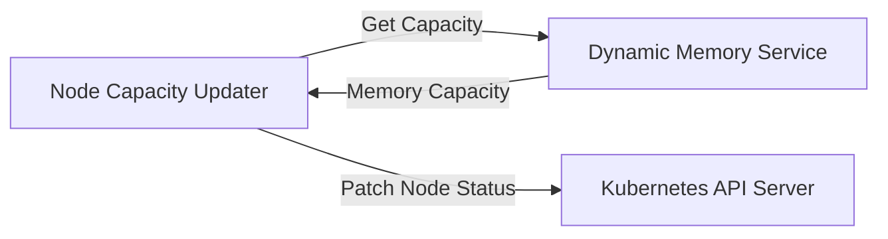

### 4. Dynamic Memory Service

**Purpose**: External service that manages the provisioning and deprovisioning of dynamic memory on nodes.

**Responsibilities**:

- Receives requests to add or remove memory.
- Interacts with the underlying hardware (e.g., CXL DCD devices).
- Provides capacity information to the Node Capacity Updater.

**Diagram**:

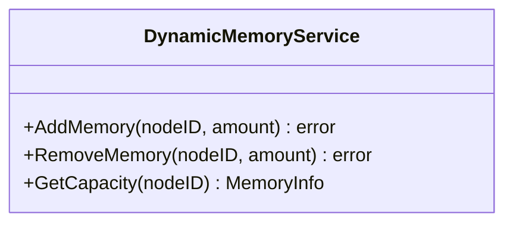

### 5. Custom Resource Definitions (CRDs)

**Purpose**: Defines custom Kubernetes API objects for managing dynamic memory resources.

**Components**:

- **DynamicMemoryResource**: Represents the dynamic memory resource type.
- **DynamicMemoryClaim**: Represents a claim/request for dynamic memory by a pod.

**Diagram**:

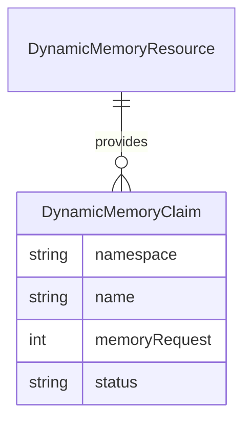

### 6. Kubectl Plugin

**Purpose**: Extends `kubectl` with commands to manage and inspect dynamic memory resources.

**Features**:

- View dynamic memory allocations.
- Inspect `ResourceClaims` and their statuses.
- Debug allocation issues.

**Example Commands**:

- `kubectl dynamic-memory get claims`
- `kubectl dynamic-memory describe claim <name>`

### 7. Metrics Exporter

**Purpose**: Collects and exposes metrics related to dynamic memory usage for monitoring purposes.

**Responsibilities**:

- Exposes metrics via HTTP for Prometheus scraping.
- Provides insights into memory allocation, utilization, and errors.

**Key Metrics**:

- Total dynamic memory allocated per node.
- Number of successful/failed allocation requests.
- Memory provisioning latency.

---

## Workflow

### 1. Pod Creation and Scheduling

- **User** creates a pod that requires dynamic memory.
- **Pod Spec** includes a `ResourceClaim` for dynamic memory.
- **Scheduler Plugin** intercepts the scheduling process.

**Diagram**:

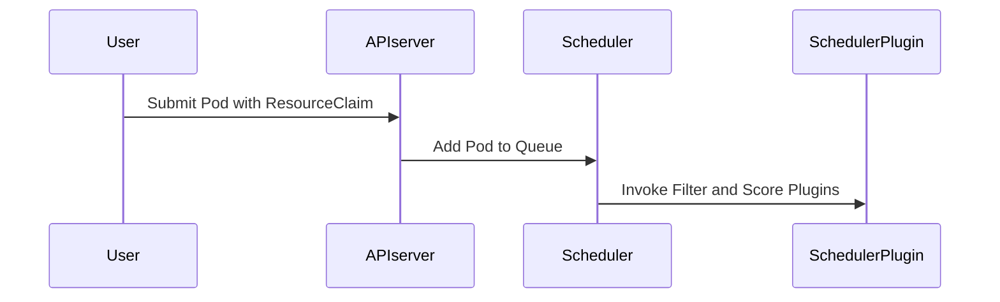

### 2. Dynamic Memory Allocation

- **Scheduler Plugin** determines if nodes can satisfy the dynamic memory request.
- **DRA Driver** processes the `ResourceClaim`.
- **DRA Driver** communicates with the **Dynamic Memory Service** to allocate memory.

**Diagram**:

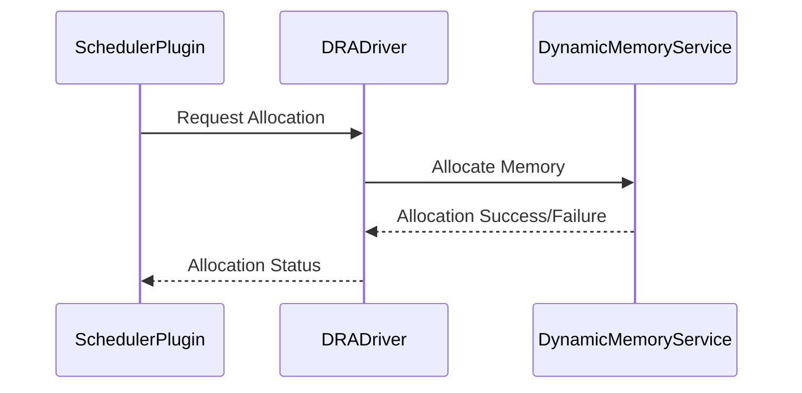

### 3. Node Capacity Update

- **Dynamic Memory Service** provisions memory on the node.
- **Node Capacity Updater** detects the new memory capacity.
- **Node Capacity Updater** updates the node status in the Kubernetes API.

**Diagram**:

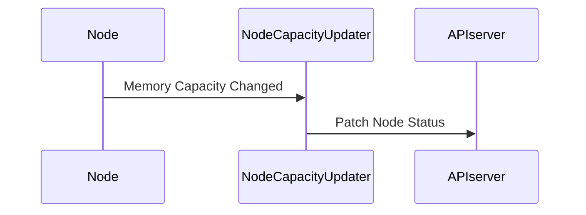

### 4. Pod Execution

- **Scheduler** binds the pod to the node with sufficient memory.
- **Kubelet** starts the pod on the node.
- Pod consumes the dynamically allocated memory during execution.

### 5. Pod Termination and Resource Cleanup

- **Pod** completes execution or is terminated.
- **DRA Driver** triggers deallocation of dynamic memory.
- **Dynamic Memory Service** releases the memory back to the pool.
- **Node Capacity Updater** updates the node status to reflect reduced capacity.

---

## Component Interactions

The following sequence diagram illustrates the end-to-end interaction between components during the lifecycle of a pod requesting dynamic memory.

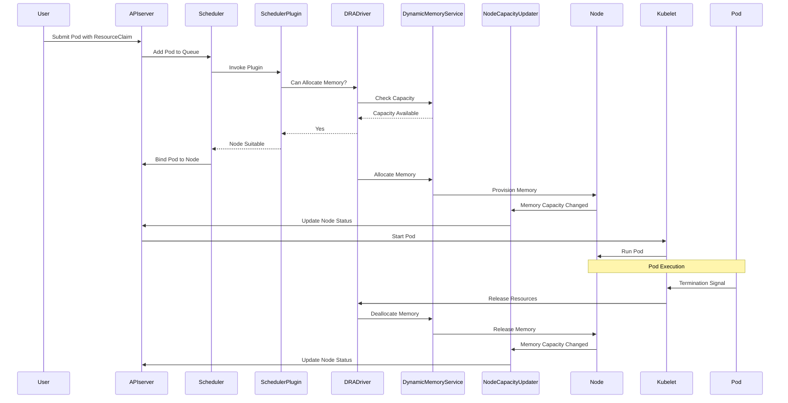

---

## Security Considerations

- **Authentication and Authorization**:
  - Secure gRPC communications between components using mutual TLS.
  - Implement Kubernetes RBAC policies to control access to resources.
- **Data Integrity**:
  - Validate all inputs and outputs between components.
  - Ensure that the node status updates are accurate and authenticated.
- **Isolation**:
  - Use Kubernetes namespaces and network policies to isolate components.
  - Run components with the least privileges necessary.

---

## Scalability and Performance

- **Scalability**:
  - Components are designed to scale horizontally.
  - The DRA driver and scheduler plugin can handle multiple concurrent requests.
- **Performance**:
  - Use efficient communication protocols (gRPC) for low latency.
  - Cache capacity information where appropriate to reduce load on the dynamic memory service.

---

## Monitoring and Metrics

- **Metrics Exporter**:
  - Exposes Prometheus metrics for dynamic memory operations.
- **Key Metrics**:
  - `dynamic_memory_allocations_total`: Total number of memory allocations.
  - `dynamic_memory_allocation_errors_total`: Total number of allocation failures.
  - `dynamic_memory_current_usage_bytes`: Current dynamic memory usage per node.
- **Alerting**:
  - Set up alerts for high memory utilization or allocation failures.

**Diagram**:

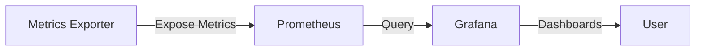